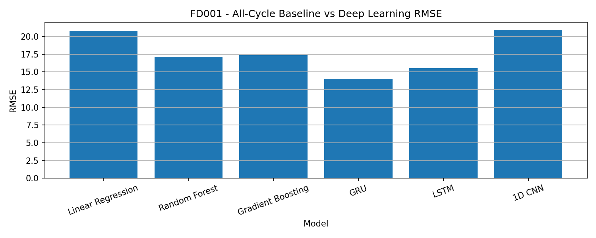
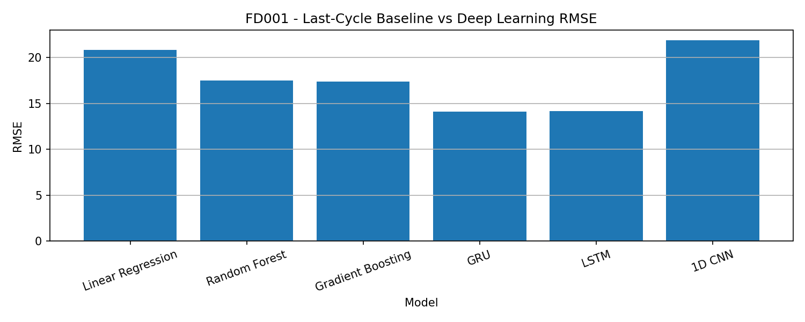
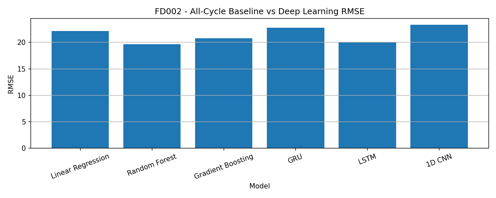
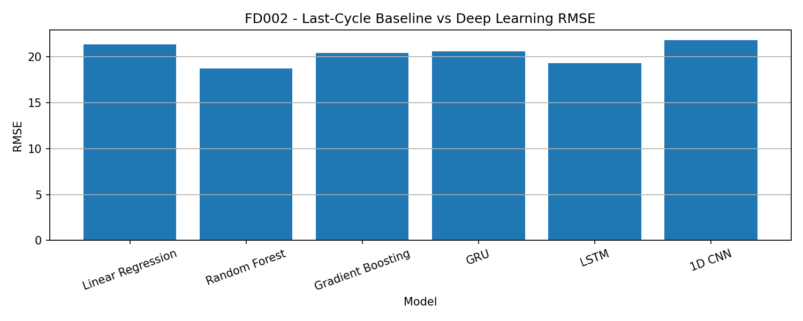
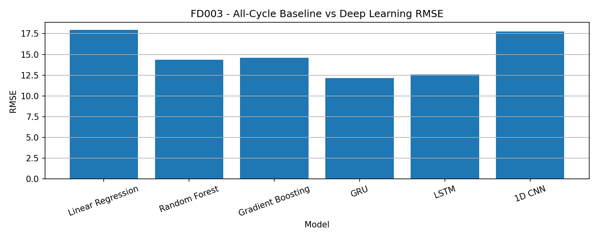
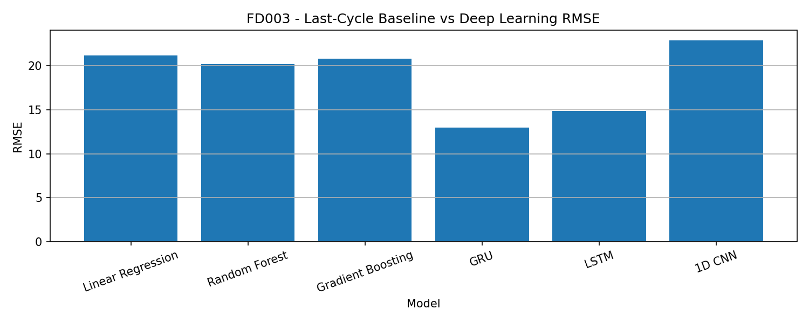
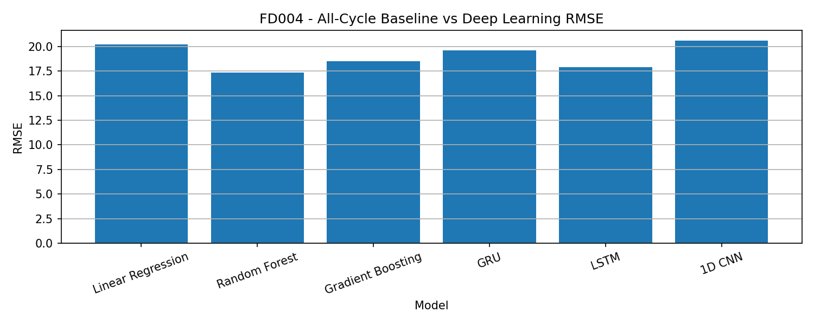
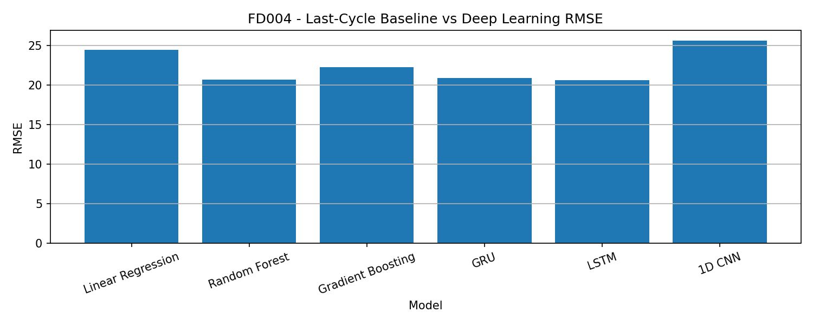

# Turbofan RUL Predictive Maintenance

This project predicts the Remaining Useful Life (RUL) of turbofan engines using the NASA C-MAPSS dataset.

The goal is to build a complete predictive maintenance pipeline. The project starts with classical machine learning models and then continues with deep learning models for time-series data.

The project includes:

- Data loading
- RUL label generation
- Feature scaling
- Classical machine learning baselines
- Sliding window preparation
- GRU, LSTM and 1D CNN models
- All-cycle and last-cycle evaluation
- Metrics and result plots

---

## Project Goal

Aircraft engines produce sensor data during operation. This sensor data can be used to estimate how much useful life is left before an engine reaches failure.

In this project, the input is engine sensor data and operational settings. The output is the estimated Remaining Useful Life.

```text
Input  -> operational settings + sensor measurements
Output -> Remaining Useful Life (RUL)
```

This is a supervised regression problem.

---

## Dataset

This project uses the NASA C-MAPSS Turbofan Engine Degradation Simulation Dataset.

The following subsets are used:

```text
FD001
FD002
FD003
FD004
```

Each subset has three files:

```text
train_FDxxx.txt
test_FDxxx.txt
RUL_FDxxx.txt
```

Raw dataset files are not included in this repository. They should be placed under:

```text
data/raw/
```

Example:

```text
data/raw/train_FD001.txt
data/raw/test_FD001.txt
data/raw/RUL_FD001.txt
```

---

## Dataset Structure

Each row contains:

```text
unit_id
cycle
setting_1
setting_2
setting_3
sensor_1
...
sensor_21
```

The model uses:

```text
3 operational settings
21 sensor values
```

So each input row has 24 features.

---

## RUL Label Generation

For training data, each engine is observed until failure.

The RUL value is calculated as:

```text
RUL = max_cycle - current_cycle
```

For test data, engines are stopped before failure. The real final RUL values are stored in the `RUL_FDxxx.txt` files.

For test data:

```text
failure_cycle = max_test_cycle + final_RUL
RUL = failure_cycle - current_cycle
```

A capped RUL value is used:

```text
RUL_CAP = 125
```

This means that RUL values higher than 125 are set to 125.

---

## Methods

This project has two main parts.

### 1. Classical Machine Learning Baseline

The following baseline models are trained:

```text
Linear Regression
Random Forest
Gradient Boosting
```

These models use one row of sensor data at a time.

Input shape:

```text
N x 24
```

### 2. Deep Learning Models

The deep learning models use sliding windows.

Each sample contains the last 30 cycles of engine data.

Input shape:

```text
N x 30 x 24
```

The following deep learning models are trained:

```text
GRU
LSTM
1D CNN
```

These models were trained in Google Colab with T4 GPU.

---

## Evaluation

Two evaluation types are used.

### All-Cycle Evaluation

The model is tested on all valid test windows.

This shows the general prediction behavior of the model.

### Last-Cycle Evaluation

Only the last available window of each test engine is used.

This is closer to the official C-MAPSS test logic because the RUL file gives the RUL value at the last observed cycle.

---

## Metrics

The following regression metrics are used:

```text
MAE
RMSE
R2
```

### MAE

MAE shows the average absolute prediction error.

Example:

```text
MAE = 12
```

This means the model is wrong by about 12 cycles on average.

### RMSE

RMSE gives more penalty to large errors. It is important because large RUL prediction errors can be risky in maintenance planning.

### R2

R2 shows how much of the RUL behavior is explained by the model.

---

## Baseline Results

Classical machine learning results are saved under:

```text
outputs/metrics/
```

Main baseline files:

```text
summary_baseline_metrics_all_cycles.csv
summary_baseline_metrics_last_cycle.csv
```

A general result from the baseline stage:

```text
Tree-based models performed better than Linear Regression.
Random Forest was the most stable baseline model in most cases.
```

Example FD001 all-cycle baseline results:

| Model | MAE | RMSE | R2 |
|---|---:|---:|---:|
| Linear Regression | 16.64 | 20.75 | 0.43 |
| Random Forest | 12.45 | 17.16 | 0.61 |
| Gradient Boosting | 12.62 | 17.35 | 0.60 |

---

## Deep Learning Results

Deep learning results are saved under:

```text
outputs/metrics/
```

Main deep learning files:

```text
deep_learning_all_datasets_metrics.csv
baseline_vs_deep_learning_all_datasets.csv
best_deep_learning_all_cycle.csv
best_deep_learning_last_cycle.csv
```

The deep learning stage trains these models on all four C-MAPSS datasets:

```text
GRU
LSTM
1D CNN
```

The full comparison between classical machine learning and deep learning models is stored in:

```text
outputs/metrics/baseline_vs_deep_learning_all_datasets.csv
```

The best deep learning models are stored in:

```text
outputs/metrics/best_deep_learning_all_cycle.csv
outputs/metrics/best_deep_learning_last_cycle.csv
```

---

## Main Result Plots

The following plots compare classical machine learning models and deep learning models using RMSE.

Lower RMSE means better prediction performance.

### FD001

All-cycle comparison:



Last-cycle comparison:



---

### FD002

All-cycle comparison:



Last-cycle comparison:



---

### FD003

All-cycle comparison:



Last-cycle comparison:



---

### FD004

All-cycle comparison:



Last-cycle comparison:



---

## Other Output Figures

Each dataset folder also contains:

```text
training loss plots
actual vs predicted RUL plots
prediction error histograms
```

Example folder structure:

```text
outputs/figures/FD001/
outputs/figures/FD002/
outputs/figures/FD003/
outputs/figures/FD004/
```

Example files:

```text
gru_training_loss.png
gru_actual_vs_predicted_all_cycles.png
gru_actual_vs_predicted_last_cycle.png
gru_error_histogram_all_cycles.png
gru_error_histogram_last_cycle.png

lstm_training_loss.png
lstm_actual_vs_predicted_all_cycles.png
lstm_actual_vs_predicted_last_cycle.png
lstm_error_histogram_all_cycles.png
lstm_error_histogram_last_cycle.png

1d_cnn_training_loss.png
1d_cnn_actual_vs_predicted_all_cycles.png
1d_cnn_actual_vs_predicted_last_cycle.png
1d_cnn_error_histogram_all_cycles.png
1d_cnn_error_histogram_last_cycle.png
```

---

## Project Structure

```text
turbofan-rul-predictive-maintenance/
│
├── data/
│   └── raw/
│
├── docs/
│   ├── dataset.md
│   ├── preprocessing.md
│   └── results.md
│
├── notebooks/
│   ├── 01_data_exploration.ipynb
│   ├── 02_baseline_models.ipynb
│   └── 03_colab_deep_learning_all_datasets.ipynb
│
├── outputs/
│   ├── figures/
│   │   ├── FD001/
│   │   ├── FD002/
│   │   ├── FD003/
│   │   └── FD004/
│   │
│   └── metrics/
│
├── src/
│   ├── data_loader.py
│   ├── evaluate.py
│   ├── plots.py
│   ├── preprocessing.py
│   └── train_baseline_all_datasets.py
│
├── requirements.txt
├── .gitignore
└── README.md
```

---

## How to Run Classical ML Baseline Locally

Create and activate a virtual environment.

```bash
python -m venv .venv
```

On Windows:

```bash
.venv\Scripts\activate
```

Install required packages:

```bash
pip install pandas numpy scikit-learn matplotlib
```

Run the baseline pipeline:

```bash
python src/train_baseline_all_datasets.py
```

This script trains classical ML models on:

```text
FD001
FD002
FD003
FD004
```

---

## How to Run Deep Learning Models

Deep learning models were trained in Google Colab.

Use this notebook:

```text
notebooks/03_colab_deep_learning_all_datasets.ipynb
```

Recommended runtime:

```text
T4 GPU
```

The notebook trains:

```text
GRU
LSTM
1D CNN
```

on:

```text
FD001
FD002
FD003
FD004
```

---

## Important Notes

The raw dataset is not included in this repository.

The following folders are ignored by Git:

```text
data/raw/
outputs/models/
.venv/
```

This keeps the repository clean and smaller.

Model weight files are not uploaded to GitHub. They can be regenerated by running the Colab notebook.

---

## Current Project Status

Completed:

```text
Classical ML baseline for FD001-FD004
Deep learning models for FD001-FD004
GRU, LSTM and 1D CNN training
All-cycle and last-cycle evaluation
Metric CSV files
Result plots
Colab training notebook
```

Possible next steps:

```text
Hyperparameter tuning
Different window size experiments
Feature importance analysis
Model explainability
Deployment-style inference script
```

---

## Main Learning Outcomes

This project covers:

```text
predictive maintenance
RUL prediction
time-series preprocessing
sliding window generation
classical machine learning
GRU
LSTM
1D CNN
model evaluation
Google Colab GPU workflow
GitHub project organization
```

---

## Author

Berke Can Eren

Computer Engineering student interested in:

```text
machine learning
embedded systems
flight software
aerospace systems
predictive maintenance
```